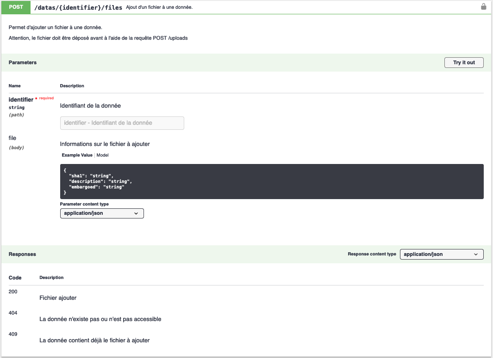
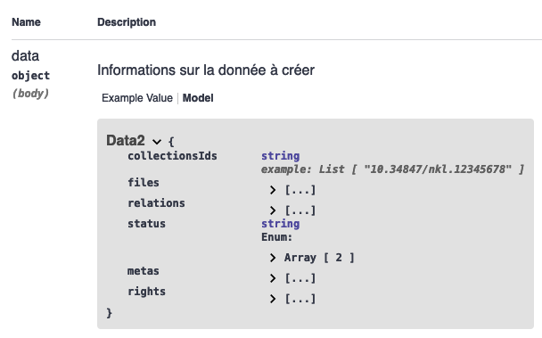

# Getting started

## Installation

## Nakala.jl et API Nakala

La librairie Nakala.jl permet d'envoyer des requêtes à l'API Nakala afin de créer, modifier ou supprimer des données, ainsi que toutes les informations et métadonnées qui les accompagnent.

Chaque fonction du package permet d'envoyer une requête à un *endpoint* spécifique de l’API et est nommée d'après ce dernier.

Pour dialoguer avec l’API, les fonctions peuvent prendre jusqu'à 3 voire 4 arguments obligatoires :

- `identifier` : identifiant de la donnée, de la collection, etc. que l’on souhaite requêter ;
- `headers` : l'entête HTTP, contenant généralement votre clé API et, selon la requête, le type de données envoyées et le type de données acceptées en retour ;
- `body` : le corps de votre requête contenant des informations structurées
- `params` : des paramètres qui sont passés dans l’url de la requête, afin, souvent, de filtrer les résultats.

Le contenu attendu des éléments `headers`, `body` et `params` et l'objet retourné par la requête sont fournis par la [documentation de l’API](https://api.nakala.fr/doc). Pour les néophytes, la documentation sert aussi de bac à sable, vous permettant de visualiser les paramètres envoyés avec la requête.



## Prise en main
Pour prendre en main Nakala.jl, voyons comment déposer une donnée sur Nakala, puis comment la modifier. Pour interagir avec l'API, il est nécessaire de disposer d'une clé API, pour les besoins de cet exemple, nous utiliserons une clé publique fournie avec [l'API de test](https://test.nakala.fr/).

### Déposer un fichier sur l'espace temporaire
La documentation nous apprend que les fichiers constituant une donnée doivent être déposés au préalable de la création de ladite donnée.

La fonction `postdatas_uploads()` permet de déposer un fichier dans un espace temporaire, avant qu'il soit assigné à une donnée. Elle prend deux argument :

- `file`, qui correspond au chemin vers le fichier à envoyer ;
- `headers`, l'entête de la requête.

Nous ajouterons le *keyword argument* `apitest=true` afin de travailler avec l'API de test.

```julia-repl
julia> using Nakala

julia> file = "~/mydata/file.txt"
"~/mydata/file.txt"

julia> apikey = "01234567-89ab-cdef-0123-456789abcdef"
"01234567-89ab-cdef-0123-456789abcdef"

julia> headers = Dict(
    "X-API-KEY" => apikey, # clé publique de l'API de test
    "Accept" => "application/json" # format de la réponse
)
Dict{String, String} with 2 entries:
  "Accept"    => "application/json"
  "X-API-KEY" => "01234567-89ab-cdef-0123-456789abcdef"

julia> postdatas_uploads_response = Nakala.postdatas_uploads(file, headers, apitest=true)
Dict{String, Any} with 3 entries:
  "body"      => Dict{String, Any}("name"=>"file.txt", "sha1"=>"a0b65939670bc2c010f4d5d6a0b3e4e4590fb92b")
  "status"    => 201
  "isSuccess" => true
```

La fonction `postdatas_uploads()` retourne un dictionnaire. La réponse du serveur correspond à la valeur de la clé "body".

Afin d'associer le fichier à la future donnée, il est nécessaire de récupérer son identifiant `sha1`. Cela peut être effectuer avec la commande suivante :

```julia-repl
julia> sha1 = postdatas_uploads_response["body"][sha1]
"a0b65939670bc2c010f4d5d6a0b3e4e4590fb92b"
```

### Créer la donnée
Pour créer une donnée nous aurons besoin de la fonction `postdatas()`, qui accepte elle aussi deux arguments :

- `headers`
- `body`, le corps de la requête contenant les métadonnées nécessaires à la création de la donnée. Le modèle de données nous est fourni par la documentation 



```julia-repl
julia> headers = Dict(
    "X-API-Key" => apikey,
    "Content-type" => "application/json", # format des données envoyées
    "Accept" => "application/json" # format de la réponse
)
Dict{String, String} with 3 entries:
  "Content-type" => "application/json"
  "Accept"       => "application/json"
  "X-API-Key"    => "01234567-89ab-cdef-0123-456789abcdef"

julia> body = Dict(
  :collectionsIds => [],
  :files => [ Dict("name" => "file.txt", "sha1" => sha1, "embargoed" => "2024-09-01") ],
  :status => "private",
  :metas => [
    Dict(:value => "Ma données", :propertyUri => "http://nakala.fr/terms#title", :lang => "fr", :typeUri => "http://www.w3.org/2001/XMLSchema#string"),
    Dict(:value => "http://purl.org/coar/resource_type/c_18cf", :propertyUri => "http://nakala.fr/terms#type", :typeUri => "http://www.w3.org/2001/XMLSchema#anyURI"),
    Dict(:value => Dict(:surname => "Rémi", :givenname => "Fassol"), :propertyUri => "http://nakala.fr/terms#creator", :typeUri => "http://www.w3.org/2001/XMLSchema#string"),
    Dict(:value => "2024-09-01", :propertyUri => "http://nakala.fr/terms#created", :typeUri => "http://www.w3.org/2001/XMLSchema#string"),
    Dict(:value => "PDM", :propertyUri => "http://nakala.fr/terms#license", :typeUri => "http://www.w3.org/2001/XMLSchema#string"),
    Dict(:value => "Description", :propertyUri => "http://purl.org/dc/terms/description", :lang => "fr", :typeUri => "http://www.w3.org/2001/XMLSchema#string"),
    Dict( :value => Dict( :surname => "Rémi", :givenname => "Fassol" ), :propertyUri => "http://nakala.fr/terms#creator" )
  ],
  :rights => []
)
Dict{Symbol, Any} with 5 entries:
  :status         => "private"
  :rights         => Any[]
  :files          => [Dict("name"=>"file.txt", "embargoed"=>"2024-09-01", "sha1"=>"a0b65939670bc2c010f4d5d6a0b3e4e4590fb92b")]
  :metas          => Dict{Symbol}[Dict(:value=>"Ma données", :propertyUri=>"http://nakala.fr/terms#title", :lang=>"fr", :typeUri=>"http://www.w3.org/2001/XMLSchema#str…
  :collectionsIds => Any[]

julia> postdatas_response = Nakala.postdatas(headers, body, apitest=true)
Dict{String, Any} with 3 entries:
  "body"      => Dict{String, Any}("message"=>"Data created", "payload"=>Dict{String, Any}("id"=>"10.34847/nkl.79b7786h"), "code"=>201)
  "status"    => 201
  "isSuccess" => true
```

En retour le serveur fourni l'identifiant de la données nouvellement créée (`postdatas_response["body"]["payload"]["id"]`).

### Ajouter une métadonnée
Les informations sur une donnée peuvent être consultées avec la fonction `getdatas()`, qui prend comme arguments l'identifiant de la donnée et une en-tête.

```julia-repl
julia> getdatas_response = Nakala.getdatas(identifier, headers, apitest=true)
Dict{String, Any} with 3 entries:
  "body"      => Dict{String, Any}("isDepositor"=>true, "isOwner"=>true, "depositor"=>Dict{String, Any}("name"=>"Test Nakala", "photo"=>"http://mynakala.photo", "surna…
  "status"    => 200
  "isSuccess" => true

julia> getdatas_response["body"]
Dict{String, Any} with 19 entries:
  "isDepositor"    => true
  "isOwner"        => true
  "depositor"      => Dict{String, Any}("name"=>"Test Nakala", "photo"=>"http://mynakala.photo", "surname"=>"Nakala", "givenname"=>"Test", "id"=>"26cef362-5bef-11eb-99…
  "collectionsIds" => Any[]
  "status"         => "private"
  "files"          => Any[Dict{String, Any}("name"=>"file.txt", "embargoed"=>"2024-09-01T00:00:00+02:00", "puid"=>"x-fmt/111", "humanReadableEmbargoedDelay"=>Any[], "s…
  ⋮                => ⋮

julia> getdatas_response["body"]["metas"] # les métadonnées
6-element Vector{Any}:
 Dict{String, Any}("typeUri" => nothing, "propertyUri" => "http://nakala.fr/terms#title", "lang" => "fr", "value" => "Ma données")
 Dict{String, Any}("typeUri" => nothing, "propertyUri" => "http://nakala.fr/terms#created", "lang" => nothing, "value" => "2024-09-01")
 Dict{String, Any}("typeUri" => nothing, "propertyUri" => "http://nakala.fr/terms#license", "lang" => nothing, "value" => "PDM")
 Dict{String, Any}("typeUri" => "http://purl.org/dc/terms/URI", "propertyUri" => "http://nakala.fr/terms#type", "lang" => nothing, "value" => "http://purl.org/coar/resource_type/c_18cf")
 Dict{String, Any}("typeUri" => nothing, "propertyUri" => "http://purl.org/dc/terms/description", "lang" => "fr", "value" => "Description")
 Dict{String, Any}("propertyUri" => "http://nakala.fr/terms#creator", "value" => Dict{String, Any}("orcid" => nothing, "surname" => "Rémi", "givenname" => "Fassol", "fullName" => "Fassol Rémi", "authorId" => "ca0fa856-3f7f-4e31-b339-066e173beeaf"))
```

Maintenant, supposons que nous souhaitons ajouter une nouvelle métadonnée, le titre anglais de la donnée par exemple. Nous pourrons effectuer cette opération à l'aide de la fonction `postdatas_metadatas()` qui prend trois arguments : l'identifiant de la donnée (`identifier`), l'en-tête (`headers`) et la nouvelle métadonnée structurée en JSON dans le `body`.

La documentation nous apprend que toute métadonnée doit contenir :

- une propriété ;
- une valeur ;
- un type (optionnel) ;
- un format (optionnel),


```json
{
  "value": "string",
  "lang": "string",
  "typeUri": "string",
  "propertyUri": "string"
}
```

Il est possible d'exprimer cet objet avec un dictionnaire Julia :

```julia-repl
julia> body = Dict( 
    :value => "My Data", 
    :lang => "en",
    :propertyUri => "http://nakala.fr/terms#title", 
    :typeUri => "http://www.w3.org/2001/XMLSchema#string"
)
Dict{Symbol, String} with 4 entries:
  :value       => "My Data"
  :propertyUri => "http://nakala.fr/terms#title"
  :lang        => "en"
  :typeUri     => "http://www.w3.org/2001/XMLSchema#string"

julia> postdatas_metadatas(identifier, headers, body, apitest=true)
Dict{String, Any} with 3 entries:
  "body"      => Dict{String, Any}("message"=>"1", "code"=>201)
  "status"    => 201
  "isSuccess" => true
```

### Supprimer une métadonnée
Tant qu'une donnée n'est pas publiée, il est possible de la supprimer à l'aide de la fonction `deletedatas()`, qui accepte deux arguments, l'identifiant de la donnée à supprimer et une en-tête.

```julia-repl
julia> headers = Dict( "X-API-KEY" => apikey, :accept => "application/json" )
Dict{String, String} with 3 entries:
  :accept       => "application/json"
  "X-API-Key"    => "01234567-89ab-cdef-0123-456789abcdef"

julia> deletedatas(identifier, headers)
Dict{String, Any} with 3 entries:
  "body"      => ""
  "status"    => 204
  "isSuccess" => true
```
